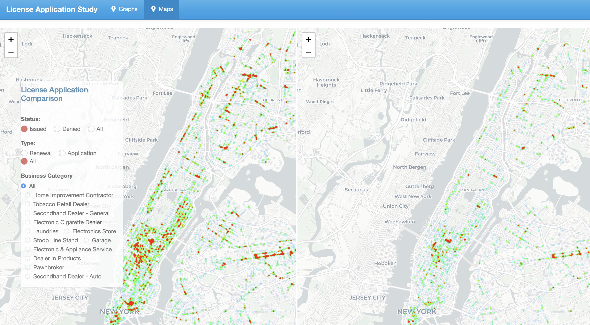

# Project 2: Shiny App Development

### [Project Description](doc/project2_desc.md)



Until today, the pandemic has been lasted around 2 years. During this period, how people's life were changed? Would the pandemic affect people's decision about operating business heavily? 
In this project, we develop an *Exploratory Data Analysis and Visulization* shiny app on the [License Application](https://data.cityofnewyork.us/Business/License-Applications/ptev-4hud) dataset released on the [NYC Open Data By Agency](https://opendata.cityofnewyork.us/data/) website. From the applications of DCA Licenses, we can explore the number of newly invested business and the ones returned in NYC. In more depth, we can also explore the situations of each category and different business types. By combining data from license application and the pandemic Covid-19, we further investigate how the pandemic affects business applications and operations.

The **learning goals** for this project is:

- business intelligence for data science
- data cleaning
- data visualization
- systems development/design life cycle
- shiny app/shiny server

*The above general statement about project 2 can be removed once you are finished with your project. It is optional.

##
Term: Spring 2022
+ Group 3
+ **How does people's passion for business dynamically change with Covid-19?**:
	+ Guosheng Cai
	+ Sibo Geng
	+ Ke Liu
	+ Xubo Wang

+ **Project summary**: In this project, we have developed a shiny app that can explore how business operations can be affected by Covid-19. We have discovered that at the beginning of the pandemic, there are evident data shown that the motivation of people starting a new business was decreased. However, as time elapsed, people have experienced several Covid-19 outbreaks and maybe have been used to it that people's passion about business has returned. 

+ **Contribution statement**: ([default](doc/a_note_on_contributions.md)) All team members contributed equally in all stages of this project. All team members approve our work presented in this GitHub repository including this contributions statement. 

Following [suggestions](http://nicercode.github.io/blog/2013-04-05-projects/) by [RICH FITZJOHN](http://nicercode.github.io/about/#Team) (@richfitz). This folder is orgarnized as follows.

```
proj/
├── app/
├── lib/
├── data/
├── doc/
└── output/
```

Please see each subfolder for a README file.

